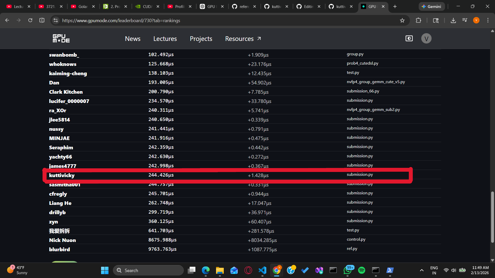
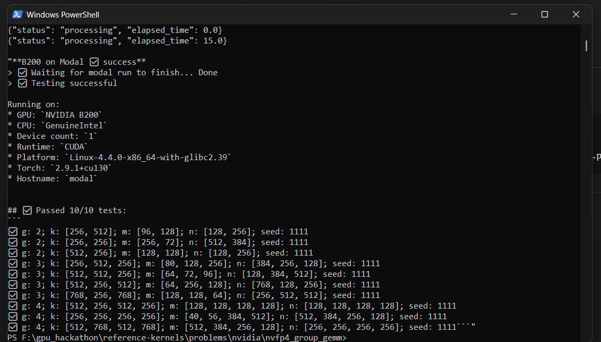

# nvidia-Blackwell-nvfp4-group-gemm
Ranked NVFP4 block-scaled Group GEMM submission on NVIDIA Blackwell (B200) using CUTLASS DSL (CuTe) with double-buffered TMA pipelining.

# Blackwell NVFP4 Block-Scaled Group GEMM (CUTLASS DSL)

## Overview

Ranked submission for the GPU MODE NVIDIA Blackwell NVFP4 Group GEMM challenge (leaderboard: nvfp4_group_gemm), evaluated on NVIDIA Blackwell B200.

- Rank: 53 / 62
- Hardware: NVIDIA B200 (single GPU)
- Runtime: CUDA
- PyTorch: 2.10.0+cu130

This repository contains the exact `submission.py` used for the successful ranked run, plus a short write-up of the optimization applied.

## What the kernel computes

Block-scaled FP4 Group GEMM:
```python
    C = A * SFA * B * SFB
```
Where:

- A, B: NVFP4 (Float4E2M1FN)
- SFA, SFB: FP8 (Float8E4M3FN) scale factors (block scaling, vec size 16)
- C: FP16 output
- Grouped GEMM: each group can have different (m, n, k), with l = 1

## Optimization applied (minimal, performance-focused)

Change applied to improve memory/compute overlap under leaderboard constraints:

- Pipeline staging increased from 1 -> 2

In `submission.py`:

    num_acc_stage = 2
    num_ab_stage  = 2

Effect:

- Enables double-buffered staging for A/B and accumulator pipeline
- Improves overlap of TMA transfers and tensor-core compute
- Prevents leaderboard benchmarking timeout and completes ranked run

## Ranked benchmark results (NVIDIA B200)

Ranked Benchmark (reported by evaluation output):

Case 1:
- g: 8
- k: [7168, 7168, 7168, 7168, 7168, 7168, 7168, 7168]
- m: [80, 176, 128, 72, 64, 248, 96, 160]
- n: [4096, 4096, 4096, 4096, 4096, 4096, 4096, 4096]
- Average latency: 423 µs ± 2.0 µs
- Fastest: 364 µs
- Slowest: 476 µs

Case 2:
- g: 8
- k: [2048, 2048, 2048, 2048, 2048, 2048, 2048, 2048]
- m: [40, 76, 168, 72, 164, 148, 196, 160]
- n: [7168, 7168, 7168, 7168, 7168, 7168, 7168, 7168]
- Average latency: 416 µs ± 1.9 µs
- Fastest: 363 µs
- Slowest: 451 µs

Case 3:
- g: 2
- k: [4096, 4096]
- m: [192, 320]
- n: [3072, 3072]
- Average latency: 182 µs ± 1.4 µs
- Fastest: 157 µs
- Slowest: 223 µs

Case 4:
- g: 2
- k: [1536, 1536]
- m: [128, 384]
- n: [4096, 4096]
- Average latency: 166 µs ± 1.3 µs
- Fastest: 140 µs
- Slowest: 212 µs

Correctness: 10 / 10 tests passed.

## Technologies

- NVIDIA Blackwell (B200)
- CUTLASS DSL / CuTe
- tcgen05 tensor core MMA (NVFP4)
- TMA (Tensor Memory Accelerator)
- CUDA 13.0 runtime (cu130)
- PyTorch 2.10.0+cu130

    

    

## Attribution

This submission is based on the NVIDIA CUTLASS reference kernel provided for the GPU MODE Blackwell NVFP4 Group GEMM challenge, with performance modifications applied for ranked benchmarking.
